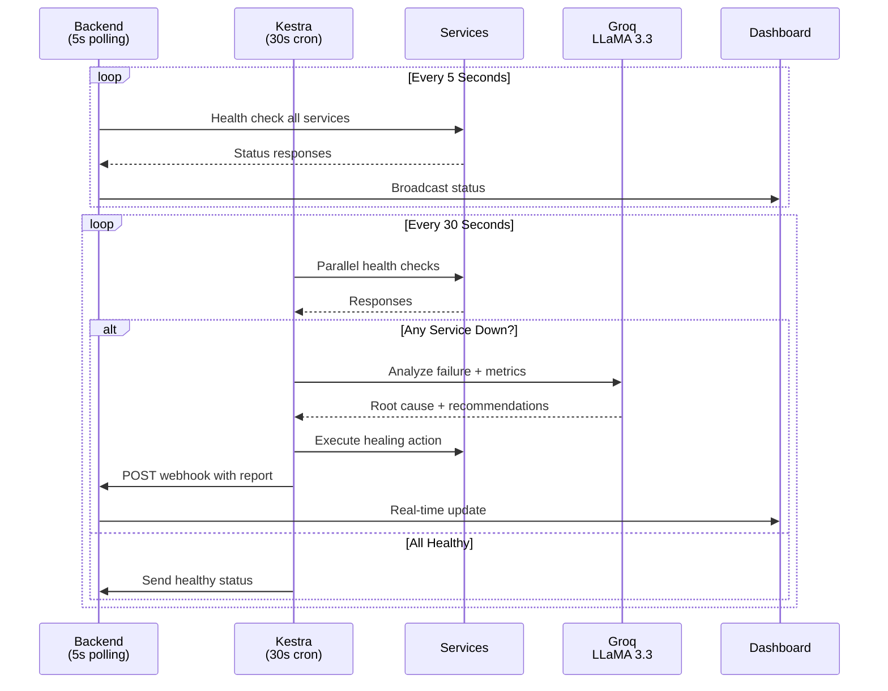

<p align="center">
  
</p>

<h1 align="center">
  
</h1>

<p align="center">
  <em>Your infrastructure never sleeps. Neither does Sentinel.</em>
</p>

<p align="center">
  <a href="https://opensource.org/licenses/MIT">
    
  </a>
  <a href="https://nodejs.org/">
    
  </a>
  <a href="https://nextjs.org/">
    
  </a>
  <a href="https://kestra.io/">
    
  </a>
  <a href="https://groq.com/">
    
  </a>
</p>

<p align="center">
  <a href="#-quick-start">Quick Start</a> •
  <a href="#-key-features">Features</a> •
  <a href="#-architecture">Architecture</a> •
  <a href="#-hackathon-achievement">Hackathon</a> •
  <a href="#-contributing">Contributing</a>
</p>

---

## 🏆 Hackathon Achievement

<div align="center">

### 🥇 **FEATURED PROJECT** at WeMakeDevs AI Agents Assemble

| Metric | Value |
|:------:|:-----:|
| **Total Teams Competing** | 6,000+ worldwide |
| **Countries Represented** | 20+ |
| **Prize Pool** | **$15,000 USD** |
| **Sentinel's Status** | ✨ **Featured in Top Projects** ✨ |

**Submitted to:** [Apertre 3.0 Open Source Programme]([https://apertre.org](https://apertre.resourcio.in/projects))

</div>

---

## 🎯 What is Sentinel?

<table>
<tr>
<td width="60%">

**Sentinel** is an **autonomous AI-powered DevOps agent** that transforms infrastructure management from reactive firefighting to proactive, self-healing operations.

Unlike traditional monitoring tools that tell you **what broke**, Sentinel tells you **why it broke** and **fixes it automatically**—without human intervention.

### The Problem We Solve

- ❌ Engineers woken at 3 AM to restart services
- ❌ Alert fatigue from constant notifications  
- ❌ MTTR (Mean Time To Recovery) measured in hours
- ❌ Post-mortem blame cycles instead of prevention

### Sentinel's Solution

- ✅ 24/7 autonomous monitoring with 5-second polling
- ✅ AI-powered root cause analysis (Groq LLaMA 3.3-70B)
- ✅ Automatic self-healing within 30 seconds
- ✅ Transparent reasoning for every decision
- ✅ Cost-optimized: AI only runs when services actually fail

</td>
<td width="40%">

<div align="center">

```
┌─────────────────────────────────┐
│     🛡️ SENTINEL ARCHITECTURE   │
├─────────────────────────────────┤
│                                 │
│   Your Infrastructure           │
│   ┌─────┐  ┌─────┐  ┌─────┐   │
│   │ 🟢  │  │ 🟢  │  │ 🔴  │   │
│   │Auth │  │ Pay │  │Notif│   │
│   └──┬──┘  └──┬──┘  └──┬──┘   │
│      │       │        │       │
│      └───────┼────────┘       │
│              ▼                │
│        ┌──────────────┐       │
│        │ 🤖 AI Engine │       │
│        │ (Kestra +    │       │
│        │  Groq)       │       │
│        └──────┬───────┘       │
│               ▼               │
│        ✨ AUTO-HEAL ✨        │
│               ▼               │
│       All Services Healthy    │
│                                 │
└─────────────────────────────────┘
```

</div>

</td>
</tr>
</table>

---

## ✨ Key Features

<table>
<tr>
<td width="50%">

### 🧠 Intelligence Layer
- **Real-time Root Cause Analysis** using LLaMA 3.3-70B
- **Predictive Failure Detection** via pattern recognition
- **Cost-Optimized AI**: Only invokes LLM when services fail
- **Human-Readable Reports** with actionable insights

### ⚡ Automation Layer
- **30-Second Kestra Orchestration** for workflow automation
- **Autonomous Self-Healing** without human approval
- **Multi-Service Monitoring** with parallel health checks
- **Intelligent Recovery Workflows** tailored to failure types

</td>
<td width="50%">

### 🎛️ Visibility Layer
- **Real-Time Dashboard** with live metrics & service status
- **AI Reasoning Panel** showing agent's decision-making
- **Incident Timeline** with recovery analytics
- **CLI Tool** for power users and developers

### 🐳 Infrastructure Layer
- **Docker Containerization** for easy deployment
- **PostgreSQL State Management** via Kestra
- **Webhook-Based Communication** between components
- **Scalable Microservices Architecture** for production use

</td>
</tr>
</table>

---

## 🖼️ System in Action

<div align="center">

### 📊 Real-Time Dashboard
*All systems healthy with live metrics and AI reasoning*


<br/><br/>

### 🚨 Detecting Failures
*Service down detected, AI analysis triggered*


<br/><br/>

### 🤖 CLI Power Tool
*Developer interface for manual operations*


</div>

---

## 🏗️ Architecture

```
┌──────────────────────────────────────────────────────────────────────────┐
│                        🛡️ SENTINEL STACK                                 │
├──────────────────────────────────────────────────────────────────────────┤
│                                                                          │
│  ┌────────────────┐    ┌────────────────┐    ┌────────────────┐        │
│  │   📱 FRONTEND  │    │  🔧 BACKEND    │    │  🤖 KESTRA     │        │
│  │  Next.js 16    │◄──►│  Express.js    │◄──►│  Orchestrator  │        │
│  │  Port: 3000    │    │  Port: 4000    │    │  Port: 9090    │        │
│  └────────────────┘    └────────┬───────┘    └────────┬───────┘        │
│                                 │                     │                 │
│                    ┌────────────┴─────────────────────┘                 │
│                    ▼                                                    │
│   ┌─────────────────────────────────────────────────────────────────┐  │
│   │         🐳 DOCKER NETWORK (Services + State)                    │  │
│   ├─────────────────────────────────────────────────────────────────┤  │
│   │                                                                 │  │
│   │  ┌──────────┐   ┌──────────┐   ┌──────────┐   ┌─────────────┐ │  │
│   │  │ 🔐 Auth  │   │ 💳 Pay   │   │ 📧 Notif │   │ 🗄️ Postgres  │ │  │
│   │  │  :3001   │   │  :3002   │   │  :3003   │   │   :5432     │ │  │
│   │  └──────────┘   └──────────┘   └──────────┘   └─────────────┘ │  │
│   │                                                                 │  │
│   └─────────────────────────────────────────────────────────────────┘  │
│                                                                          │
│                            ┌──────────┐                                 │
│                            │ 🧠 GROQ  │                                 │
│                            │ LLaMA AI │                                 │
│                            └──────────┘                                 │
│                                                                          │
└──────────────────────────────────────────────────────────────────────────┘
```

### How It Works



### Recovery Timeline

| Time | Event |
|:----:|:------|
| **0s** | Service crashes |
| **5s** | Backend detects (5-second polling) |
| **30s** | Kestra scheduled check runs |
| **32s** | AI analyzes root cause |
| **35s** | Healing action executes |
| **40s** | Service restored ✅ |

**Worst-case recovery: ~65 seconds** (when service fails just after Kestra check)

---

## 🛠️ Tech Stack

| Layer | Tech | Purpose |
|:-----:|:-----|:--------|
| **Frontend** | Next.js 16, TypeScript, Tailwind CSS, Recharts | Real-time dashboard with glassmorphism UI |
| **Backend** | Node.js, Express, Axios | Health aggregation, webhook handler, REST API |
| **Orchestration** | Kestra, YAML workflows, PostgreSQL | Automation, state management, scheduling |
| **AI/Intelligence** | Groq API (LLaMA 3.3-70B) | Root cause analysis, recommendations |
| **Infrastructure** | Docker, Docker Compose, 3 Mock Services | Containerization, networking, simulation |
| **CLI** | Commander.js, Chalk, cli-table3 | Developer interface, chaos testing |

---

## 🚀 Quick Start

### Prerequisites

- **Docker** & **Docker Compose** (v20+)
- **Node.js** 18+ (for local development)
- **PostgreSQL** 12+ (required for RBAC system - included in docker-compose)
- **Groq API Key** ([Free at console.groq.com](https://console.groq.com))

> **Note:** The RBAC system requires PostgreSQL. When using `docker-compose up`, PostgreSQL is automatically started. For local development, install PostgreSQL separately or use the containerized version.

### ⚡ One-Command Setup

```bash
# Clone the repository
git clone https://github.com/SKfaizan-786/sentinel-devops-agent.git
cd sentinel-devops-agent

# Set up environment variables
cp backend/.env.example backend/.env
# ⚠️  Edit backend/.env and set a strong JWT_SECRET before starting!

# Start the entire stack (includes PostgreSQL for RBAC)
docker-compose up -d

# Initialize RBAC system (first time only)
cd backend
npm install
npm run quick-setup

# That's it! Access at:
# 🌐 Dashboard: http://localhost:3000
# 🤖 Kestra UI: http://localhost:9090
# 📊 Backend API: http://localhost:4000
```

> **⚠️ Security Warning:** The quick-setup creates a default admin account (`admin@example.com` / `password123`) for development. **Change this password immediately** in production environments!

### 🔧 Development Setup

<details>
<summary><b>Expand for full development guide</b></summary>

```bash
# 1. Start infrastructure (includes PostgreSQL for RBAC)
docker-compose up -d kestra postgres auth-service payment-service notification-service

# 2. Set up RBAC system
cd backend
cp .env.example .env
# ⚠️  Edit .env and set JWT_SECRET to a strong random value:
# node -e "console.log(require('crypto').randomBytes(32).toString('hex'))"
npm install
npm run quick-setup  # Creates database schema and default admin

# 3. Start backend (in same terminal)
npm start

# 4. Start frontend (in new terminal)
cd ../sentinel-frontend
npm install
npm run dev

# 5. Optional: Install CLI
cd ../cli
npm install
npm link

# Now accessible at:
# Dashboard: http://localhost:3000
# Backend: http://localhost:4000
# Kestra: http://localhost:9090
# PostgreSQL: localhost:5432 (for RBAC)
# CLI: sentinel status

# ⚠️  Default admin credentials (DEVELOPMENT ONLY):
# Email: admin@example.com
# Password: password123
# Change immediately in production!
```

</details>

---

## 🖥️ CLI Usage

Sentinel includes a powerful CLI for DevOps engineers:

```bash
# View system health
sentinel status

# Simulate failures (chaos testing)
sentinel simulate auth down
sentinel simulate payment degraded
sentinel simulate notification slow

# Trigger manual healing
sentinel heal auth

# Generate AI incident report
sentinel report
```

**Example Output:**
```
$ sentinel status

🛡️  SENTINEL STATUS
━━━━━━━━━━━━━━━━━━━━━━━━━━━━━━━━━━

  Service              Status    Latency   
  ─────────────────────────────────────────
  auth-service         🟢 UP     45ms      
  payment-service      🟢 UP     52ms      
  notification-service 🟢 UP     38ms      

━━━━━━━━━━━━━━━━━━━━━━━━━━━━━━━━━━
Last Check: 2026-02-01T10:30:00Z
AI Status: Active & Monitoring
```

---

## 🧪 Test the Auto-Healing

**Live Demo Scenario:**

```bash
# Terminal 1: Watch the dashboard
open http://localhost:3000

# Terminal 2: Crash a service
sentinel simulate auth down

# Watch what happens:
# 1. Dashboard status → RED (within 5s)
# 2. AI panel → "Analyzing..."
# 3. After 30s → Kestra runs + triggers healing
# 4. Within 65s total → Service restored, status → GREEN
```

---

## 🏆 Hackathon Qualifications

| Track | Achievement |
|:-----:|:------------|
| **🤖 Kestra** | Autonomous Kestra orchestration with parallel health checks, conditional AI invocation, and self-healing workflows |
| **💻 Cline** | Built with Cline's assistance. Production-ready CLI embodies autonomous developer workflows |
| **🐰 CodeRabbit** | AI-powered code reviews on every PR ensure enterprise-grade quality |
| **🌐 Vercel** | Real-time dashboard deployed on Vercel with optimized Next.js |

---

## 📚 Documentation

<div align="center">

| Document | Content |
|:--------:|:--------|
| [**DOCUMENTATION.md**](docs/DOCUMENTATION.md) | Complete docs index |
| [**ARCHITECTURE.md**](docs/ARCHITECTURE.md) | System design deep-dive |
| [**DEVELOPMENT.md**](docs/DEVELOPMENT.md) | Setup & development guide |
| [**CONTRIBUTING.md**](CONTRIBUTING.md) | How to contribute |
| [**SECURITY.md**](docs/SECURITY.md) | Security policy & disclosure |
| [**API.md**](docs/API.md) | REST API reference |
| [**FAQ.md**](docs/FAQ.md) | 50+ Q&A |
| [**ROADMAP.md**](docs/ROADMAP.md) | Future features |

</div>

---

## 🤝 Contributing

We welcome contributions! Sentinel is open source and beginner-friendly.

```bash
# Fork → Clone → Branch → Code → Push → PR
git checkout -b feature/amazing-feature
git commit -m "feat: add amazing feature"
git push origin feature/amazing-feature
```

See [CONTRIBUTING.md](CONTRIBUTING.md) and [CODE_OF_CONDUCT.md](CODE_OF_CONDUCT.md).

---

## 📄 License

MIT License - see [LICENSE](LICENSE) for details.

---

## 👥 Team

<p align="center">
  <table>
    <tr>
      <td align="center">
        <a href="https://github.com/SKfaizan-786">
          
          <br />
          <sub><b>@SKfaizan-786</b></sub>
        </a>
        <br />
        Backend & Orchestration
      </td>
      <td align="center">
        <a href="https://github.com/mdhaarishussain">
          
          <br />
          <sub><b>@mdhaarishussain</b></sub>
        </a>
        <br />
        Frontend & Dashboard
      </td>
    </tr>
  </table>
</p>

<p align="center">
  Built with ❤️ for the <b>WeMakeDevs AI Agents Assemble Hackathon</b>
  <br/>
  Featured in the Top Projects (6000+ teams worldwide)
</p>

---

## ⭐ Show Your Support

If Sentinel helped you, give us a star! ⭐

[](https://github.com/SKfaizan-786/sentinel-devops-agent/stargazers)

**Share with your network:**

[](https://twitter.com/intent/tweet?text=Check+out+Sentinel+-+an+AI-powered+DevOps+agent+that+predicts+and+heals+infrastructure+failures+autonomously!+https://github.com/SKfaizan-786/sentinel-devops-agent)
[](https://www.linkedin.com/sharing/share-offsite/?url=https://github.com/SKfaizan-786/sentinel-devops-agent)

---

<p align="center">
  
  <br/>
  <strong>Sentinel</strong>
  <br/>
  <em>"Monitoring that never sleeps"</em>
  <br/><br/>
  Made with 🛡️ by the Sentinel Team
</p>
